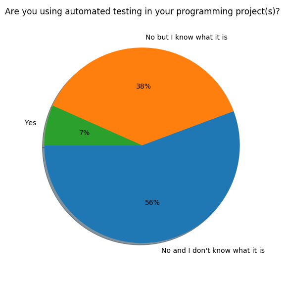
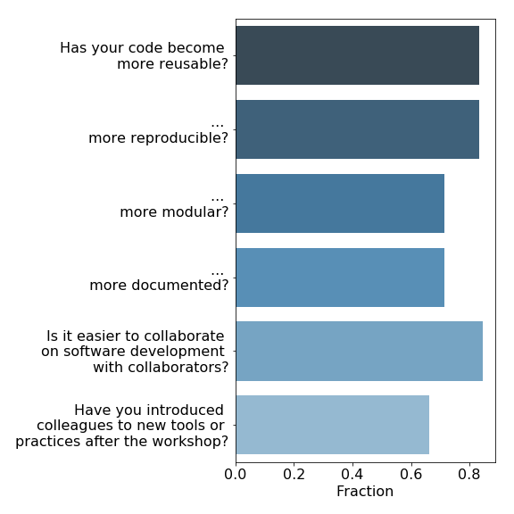
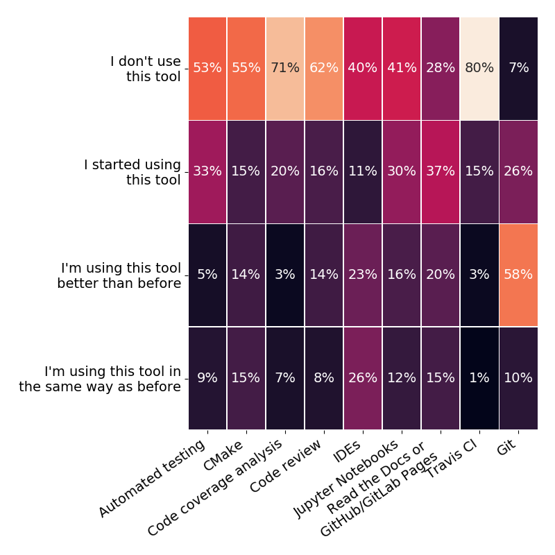

background-image: url(images/IMG_0054.jpg)
background-size: 1600px 900px

# http://bit.ly/coderefinery-eunis19

???
Mention the link
Restart timer with t

---

background-image: url(images/IMG_0054.jpg)
background-size: 1600px 900px
class: center, middle, inverse

# NeIC's CodeRefinery Project

## Bjørn Lindi, Radovan Bast, Thor Wikfeldt

Nordic e-Infrastructure Collaboration/(NTNU, UiT and KTH)

???

Do a Present: 
- Radovon, work at the HPC-group at UiT, The project manger of CodeRefinery
- Thor, work at PDC at KTH
- yourself - work at the HPC-group at NTNU, participate in different NeIC projects

--- 
background-image: url(images/IMG_0054.jpg)
background-size: 1600px 900px
## .blue[Part 1/3]

- The Nordic e-Infrastructure Collaboration
- CodeRefinery
- What are we(CodeRefinery) doing?

## .blue[Part 2/3]

- The CodeRefinery Content and Format
- The background of the CodeRefinery Workshop participant
- Parallels between the research process and program development

## .blue[Part 3/3]
- Open Data and Open Software and the scientific process
- Are the tools used after a while?
- Recommendations/Conclusions

???

* Say a few words about NeIC and CodeRefinery
* CodeRefinery do a pre- and post-survey among the workshop participants. We
  will look at the results
* We will discuss how our experience relates to the Open Research Life Cycle.

---
background-image: url(images/IMG_0054.jpg)
background-size: 1600px 900px

NeIC is hosted by NordForsk, which provides for and facilitates cooperation on
research and research infrastructure across the Nordic and Baltic region.

In 2018 NeIC organized 11 project, of which CodeRefinery is one, with a project staff of 158
people from all Nordic countries and Estonia.

NeIC will be the coordinator of the European Open Science Cloud-Nordic and lead
a Work Package on FAIR data, starting 1 September 2019.

???

The staff of 158 people are from all the Nordic countries and Estonia

---

background-image: url(images/IMG_0054.jpg)
background-size: 1600px 900px

## CodeRefinery

We are working with students, researchers, Research Software Engineers from all disciplines and national e-infrastructure partners to advance FAIRness of Software management and development practices so that research groups can collaboratively develop, review, discuss, test, share and reuse their codes.

???
* CodeRefinery was started late 2016
* Currently the project is in its second project period, ending autumn 2021
* The project aim for establishing a network of CodeRefinery instructors (similar to the Carpentries)
* Findable, Accessible, Inter-operable, Reusable - FAIR - https://www.go-fair.org/

---

background-image: url(images/IMG_0054.jpg)
background-size: 1600px 900px

## How are we (CodeRefinery) working with all these people?

We teach tools and practices for the development of reproducible and reusable
research software during a three-day workshop.

--

## The content of the workshop is
* Basic and collaborative Git
* Git branch design
* Code documentation
* Automated testing
* Jupyterlab/ Jupyter Notebooks
* Integrated Development Environments
* Building portable code with CMake
* Social coding and open software
* Modular code development
* Reproducible research

???
* The format is very similar to the Software Carpentry
* It is talk, type along, discussions and exercises - all interleaved
* A lot of focus on Git and GitHub
* Reproducible research contains exercises with Snakemake, make and using Zenodo, https://zenodo.org/

---

background-image: url(images/IMG_0054.jpg)
background-size: 1600px 900px

## The CodeRefinery Workshops have been arranged all over the Nordic region

- https://coderefinery.org
- https://coderefinery.org/workshops/

???
* Currently more than 20 workshops all over the Nordic Region + Estonia
* Approx. 600 people have been Workshop participants
* Four workshops this month (Chalmers, Univ. Helsinki, Univ. of Oslo, Univ. of Alborg) 

---

## The Workshops participants comes from many disciplines 

???
* Good representation from traditional computational disciplines.
* Many disciplines represented, though

---

## The Workshops participants have a varied background

---
## Programming experience is very varied

---

## The Workshop participants exposure to version control

---

## The Workshop participants experience with code review

---

## The Workshop participants experience with automated testing

???
There is some clear parallels between code review and automated testing on the
software side and part of the scientific process on other side:
- peer review
- calibration

---

## Peer review of paper is a established principle

---

## Peer review of code is very close, but much less common

---

## Simulations and analysis with untested software do not constitute science

"Before relying on a new experimental device, an experimental scientist always
establishes its accuracy. A new detector is calibrated when the scientist
observes its responses to known input signals. The results of this
calibration are compared against the expected response. **An experimental
scientist would never conduct an experiment with uncalibrated detectors** - that
would be unscientific. So too, simulations and analysis with untested
software do not constitute science."
(copied from [Testing and Continuous Integration with Python](http://katyhuff.github.io/python-testing/),
created by Kathryn Huff, see also the Testing chapter in
[Effective Computation In Physics](http://physics.codes) by Anthony Scopatz and Kathryn Huff)

???
Compare these two:

.quote["I don't have time to learn tool X, I am a chemist"]
.cite[developer of QC code]

.quote["I don't have time to learn how the instrument works, I am a chemist"]
.cite[experimental spectroscopist]

Compare these two:

.quote["we don't need tests, we are not a software company"]

.quote["we don't need a NMR calibration sample, we are not a pharma company"]

Software is a logical machine/device
---

## The Open Science Research life cycle

???
- There is very little mentioning of FAIR software when Open Access and Open Data is discussed.
- Code Review and Automated testing will be central to the Open Science Research Life
Cycle for it to be viable.

---

## A closer look at the Process part of the Research life cycle

???

* Software is the twin of data.
* No FAIR Open Data without FAIR Open Software.
* The High Energy Physics Software Foundation, HSF is very explicit about their
  dependency on Open Data and Open Software for advancing their field.
* This is emerging in other disciplines as well, but not so strongly expressed (system biology?)
* How do our participants fit into this picture?

---

## Has the Workshops participants' software become more usable?

---

## Are the Workshops participants using the different tools CodeRefinery has introduced?

???
* To some extent the participants are picking up the tools and methods
  taught during the workshop

---
background-image: url(images/IMG_0054.jpg)
background-size: 1600px 900px

## CodeRefinery recommendations

* Encourage students/staff to take training.
* Support training activities; take part in the Software Carpentries and
  CodeRefinery; contribute to a network of instructors.
* Encourage sharing and open source.
* Promote FAIR-principles, not only by talks and presentations - use the
  principles in pilot projects.
* FAIR principles apply both to humans and machines - data and software must be
  FAIR for both.

???
* To get involved in this type of training is a good opportunity to engage with
  people working at the research frontier. Their problems and obstacles are
  challenges for one of a university's core activities.
* Huge demand for training.

---
background-image: url(images/IMG_0054.jpg)
background-size: 1600px 900px

### https://www.coderefinery.org

- This talks is presented with cicero:https://cicero.readthedocs.io/en/latest/getting_started.html
- PDF and source is on https://github.com/blindij/talk_eunis19
