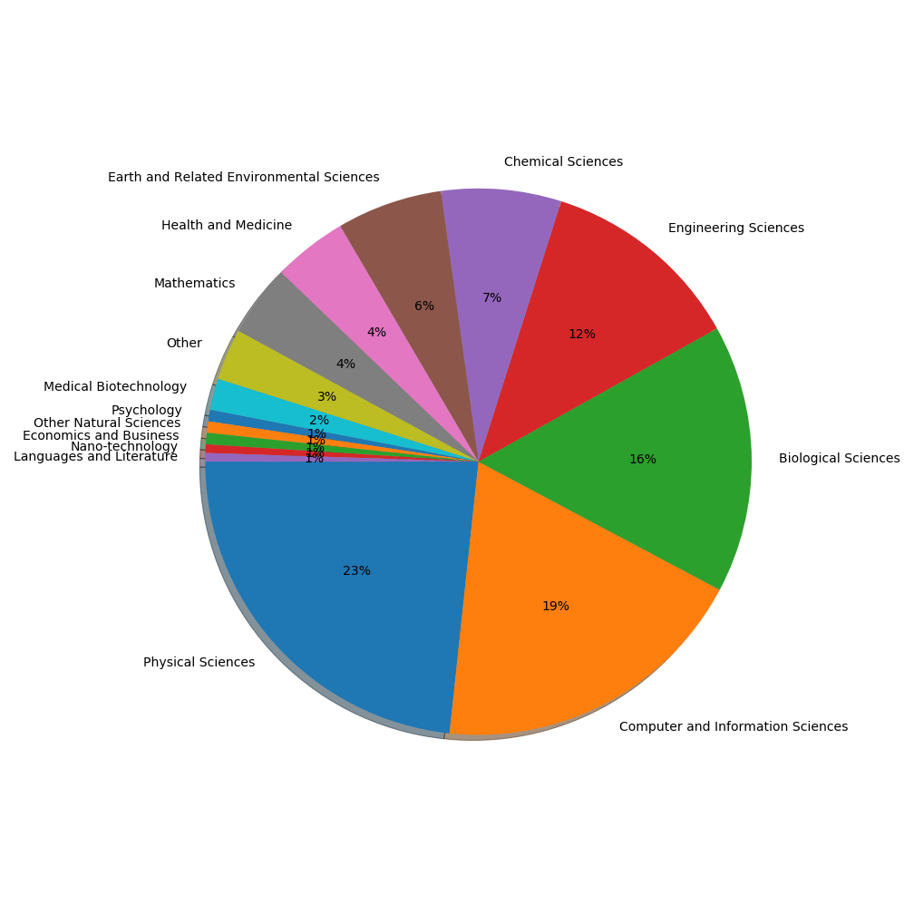
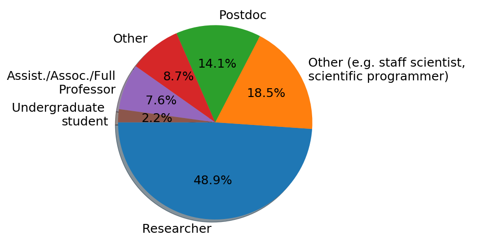
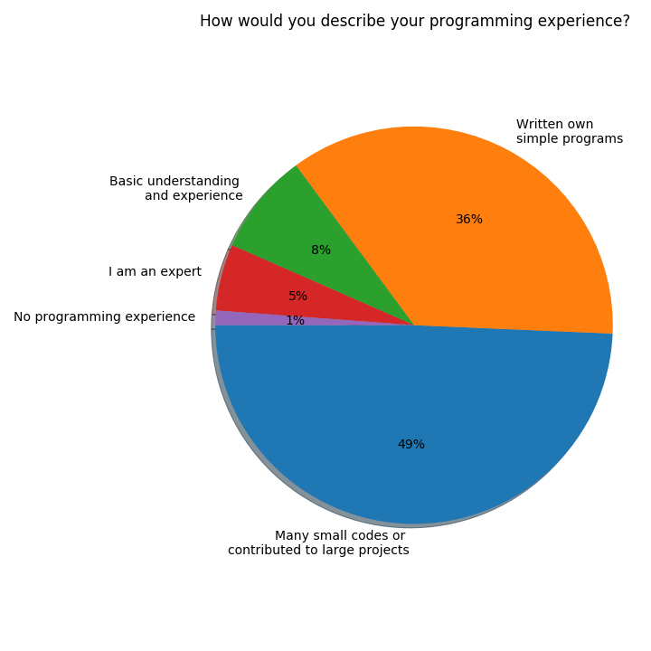
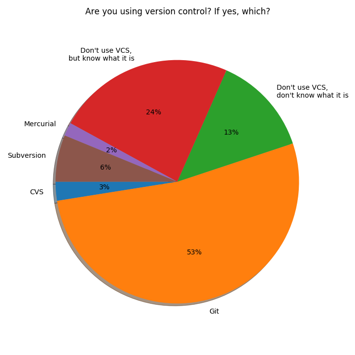
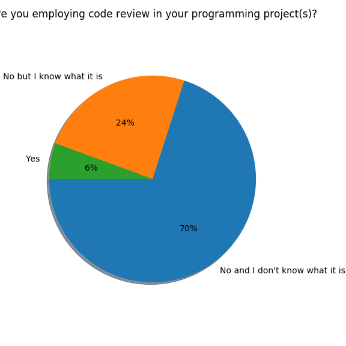
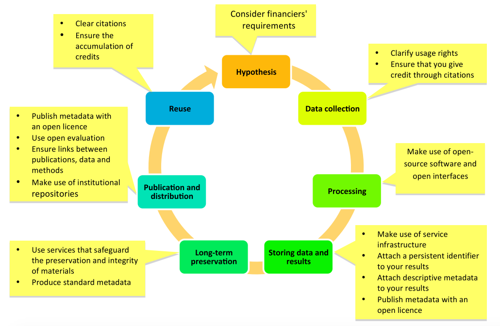
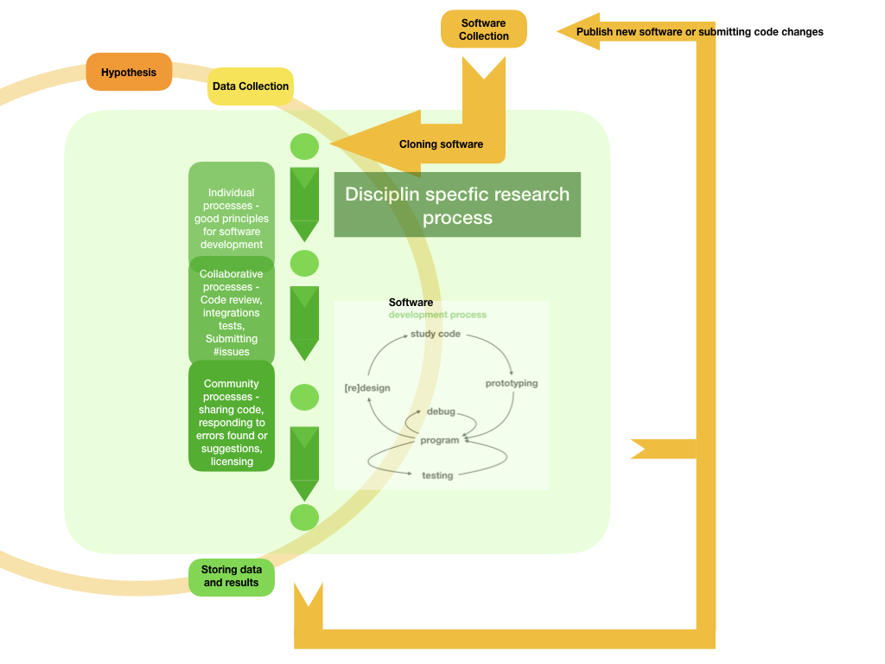

background-image: url(images/IMG_0054.jpg)
background-size: 1600px 900px

# http://bit.ly/coderefinery-eunis19

---

background-image: url(images/IMG_0054.jpg)
background-size: 1600px 900px
class: center, middle, inverse

# NeIC's CodeRefinery Project

## Bjørn Lindi, Radovan Bast, Thor Wikfeldt

Nordic e-Infrastructure Collaboration/NTNU, UiT and KTH

---

background-image: url(images/IMG_0054.jpg)
background-size: 1600px 900px
## .blue[Part 1/3]

- The Nordic e-Infrastructure Collaboration
- CodeRefinery
- What are CodeRefinery doing?

## .blue[Part 2/3]

- The CodeRefinery Workshop participant
- The CodeRefinery Content and Format
- What are our experience?

## .blue[Part 3/3]
- Research - a software and data driven process!(?)
- Research - collaborative effort
- Recommendations

---
background-image: url(images/IMG_0054.jpg)
background-size: 1600px 900px

NeIC is hosted by NordForsk, which provides for and facilitates cooperation on
research and research infrastructure across the Nordic and Baltic region.

In 2018 NeIC organized 11 project, of which CodeRefinery is one, with a project staff of 158
people from all Nordic countries and Estonia.

NeIC will be the coordinater of the European Open Science Cloud-Nordic and lead
a Work Package on FAIR data, starting 1 September 2019

---

background-image: url(images/IMG_0054.jpg)
background-size: 1600px 900px

## CodeRefinery

We are working with students, researchers, Research Software Engineers from all disciplines and national e-infrastructure partners to advance FAIRness of Software management and development practices so that research groups can collaboratively develop, review, discuss, test, share and reuse their codes.

???
* CodeRefinery was started late 2018
* Currently the project is in its second project period, ending autumn 2021
* The project aim for establishing a network of CodeRefinery teachers (similar to the Carpentries)

---

background-image: url(images/IMG_0054.jpg)
background-size: 1600px 900px

## How are CodeRefinery working with all these people?

We teach tools and practices for the development of reproducible and reusable
research software during a three-day workshop.

--

## The content of the workshop is
* Basic and collaborative Git
* Git branch design
* Code documentation
* Automated testing
* Jupyterlab/ Jupyter Notebooks
* Integrated Development Environments
* Building portable code with CMake
* Social coding and open software
* Modular code development
* Reproducible research

???
* The format is very similar to the Software Carpentries
* It is talk, type along, discussions and exercises - all interleaved

---

background-image: url(images/IMG_0054.jpg)
background-size: 1600px 900px

## The CodeRefinery Workshops have been arranged all over the Nordic reigon

- https://coderefinery.org
- https://coderefinery.org/workshops/

???
* Currently more than 20 workshops all over the Nordic Region + Estonia
* Approx. 600 people have been Workshop participants
* Four workshops this month (Chalmers, Univ. Helsinki, Univ. of Oslo, Univ. of Alborg) 

---

## The Workshops participants comes from many disciplines 

---

## The Workshops participants has a varied background

---
## Programming experience is very varied

---

## The Workshop participants exposure to version control

---

## The Workshop participants experience with code review

---

## Peer review of paper is a established principle

---

## Peer review of code is very close, but much less common

---

## The Open Science Research life cycle

---

## A closer look at the Process part of the Research life cycle

---

## CodeRefinery recommendations

* Encourage students/staff to take training
* Support training activities; take part in the Software Carpentries and
  CodeRefinery
* Encourage sharing and open source
* Promote FAIR-principles, not only by talks and presentations - use the
  principles in pilot projects
* FAIR principles apply both to humans and machines - data and software must be
  FAIR for both
