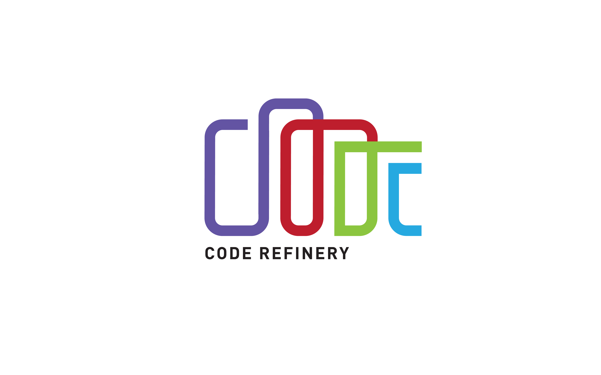
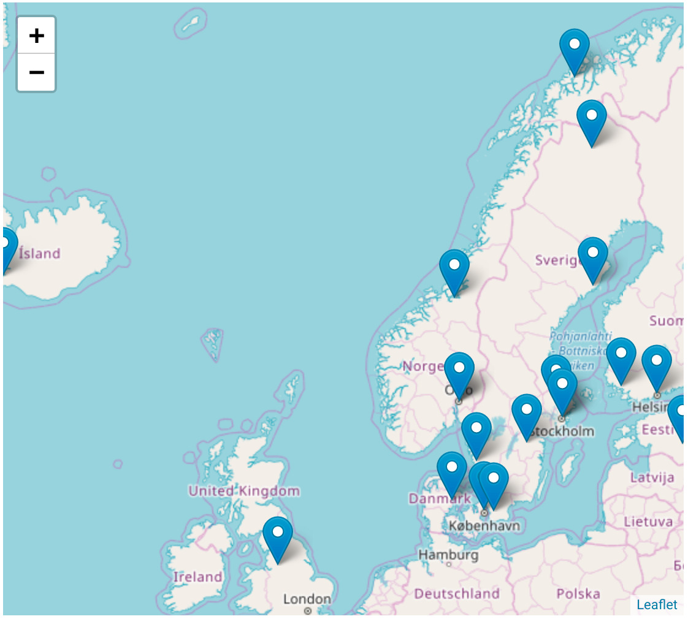

background-image: url(images/IMG_0054.jpg)

---

background-image: url(images/IMG_0054.jpg)
class: center, middle, inverse

# NeIC's CodeRefinery Project

## Bjørn Lindi, Radovan Bast, Thor Wikfeldt

Nordic e-Infrastructure Collaboration/NTNU, UiT and KTH

---

background-image: url(images/IMG_0054.jpg)
## .blue[Part 1/3]

- The Nordic e-Infrastructure Collaboration
- CodeRefinery
- What are CodeRefinery doing?

## .blue[Part 2/3]

- The CodeRefinery Workshop participant
- The CodeRefinery Content and Format
- What are our experience?

## .blue[Part 3/3]
- Research - a software and data driven process!(?)
- Research - collaborative effort
- Recommendations

---

# The Nordic e-Infrastructure Collaboration (NeIC)

background-image: url(images/IMG_0054.jpg)

NeIC is hosted by NordForsk, which provides for and facilitates cooperation on
research and research infrastructure across the Nordic and Baltic region.

In
2018 NeIC
organized 11 project, of which CodeRefinery is one, with a project staff of 158
people from all Nordic countries and Estonia.

NeIC will be the coordinater of the EOSC-Nordic

---

## CodeRefinery

We are working with students, researchers, Research Software Engineers from all disciplines and national e-infrastructure partners to advance FAIRness of Software management and development practices so that research groups can collaboratively develop, review, discuss, test, share and reuse their codes.

---

## How are CodeRefinery working with all these people?

We teach tools and practices for the development of reproducible and reusable
research software during a three-day workshop.

- https://coderefinery.org
- https://coderefinery.org/workshops/

---

## CodeRefinery

- We have trained .emph[over 550 students and researchers]
- Across all academic disciplines
- Funding for 2.5 more years

